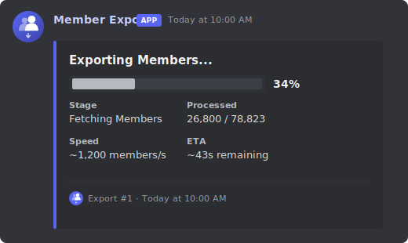

# Discord Member Export Bot

A Discord bot for exporting guild member lists with advanced filtering, real-time progress tracking, and export history.



## Features

- Export members to CSV, JSON, TXT, or XLSX
- Filter by role, join date, account age, permissions, or bot status
- Real-time progress bars with ETA and speed tracking
- Export history and statistics via SQLite
- Rate-limited fetching with automatic retry (45 req/s)

## One-Click Deploy

Host the bot on a cloud provider without any local setup:

[](https://railway.com/new/template?template=https://github.com/josh-tf/discord-member-export)

> [!NOTE]
> After deploying, set your environment variables (`DISCORD_TOKEN`, `DISCORD_CLIENT_ID`, etc.) in the provider's dashboard, then run `pnpm deploy-commands` once to register slash commands.

## Prerequisites

- Node.js 18+
- pnpm 8+
- Discord bot token with **Server Members Intent** enabled

## Setup

1. **Clone and install**

   ```bash
   git clone <repo-url>
   cd member-export
   pnpm install
   ```

2. **Configure environment**

   ```bash
   cp .env.example .env
   ```

   Edit `.env` with your credentials (see [Configuration](#configuration)).

3. **Build**

   ```bash
   pnpm build
   ```

4. **Deploy slash commands**

   ```bash
   pnpm deploy-commands        # guild-specific (instant)
   pnpm deploy-commands:global # global (up to 1 hour)
   ```

5. **Start**
   ```bash
   pnpm start
   ```

## Commands

| Command           | Description                                                                                                                                                |
| ----------------- | ---------------------------------------------------------------------------------------------------------------------------------------------------------- |
| `/export`         | Export guild members. Options: `format` (required), `fields`, `include-bots`, `role-ids`, `role-match`, `joined-after`, `joined-before`, `min-account-age` |
| `/stats`          | View export statistics for the server (totals, success rate, avg duration)                                                                                 |
| `/export-history` | View recent exports. Option: `limit` (1–25, default 10)                                                                                                    |

All commands require Administrator permission.

## Configuration

Copy `.env.example` to `.env` and fill in the required values:

```env
# Required
DISCORD_TOKEN=your_bot_token_here
DISCORD_CLIENT_ID=your_client_id_here

# Optional: set for instant guild command updates during development
DISCORD_GUILD_ID=your_guild_id

# Optional
LOG_LEVEL=info
LOG_TO_FILE=false
LOG_FILE_PATH=./logs/bot.log
MAX_CONCURRENT_EXPORTS=3
EXPORT_BATCH_SIZE=1000
```

See `.env.example` for the full list of options.

## Project Structure

```
src/
├── bot.ts                  # Main bot client
├── index.ts                # Entry point
├── config/
│   └── bot.config.ts       # Configuration
├── types/
│   ├── export.types.ts
│   ├── filter.types.ts
│   └── database.types.ts
├── services/
│   ├── MemberFetcher.ts    # Rate-limited member fetching
│   ├── FilterService.ts    # Member filtering logic
│   ├── ProgressTracker.ts  # Progress tracking & Discord updates
│   ├── ExportService.ts    # Export orchestration
│   └── database/
│       ├── DatabaseService.ts
│       ├── migrations/
│       │   └── 001_initial_schema.sql
│       └── repositories/
│           └── ExportHistoryRepository.ts
├── commands/
│   ├── CommandHandler.ts
│   ├── Command.interface.ts
│   ├── export.ts
│   ├── stats.ts
│   └── export-history.ts
└── utils/
    ├── logger.ts
    └── embeds/
        └── index.ts            # Embed factories (progress, complete, error, etc.)
```

```
assets/
├── logo.svg                    # Source vector logo
└── logo.png                    # PNG logo used in embeds
```

## Scripts

| Script                        | Description                      |
| ----------------------------- | -------------------------------- |
| `pnpm dev`                    | Run with tsx (auto-reload)       |
| `pnpm build`                  | Compile TypeScript to `dist/`    |
| `pnpm start`                  | Run compiled bot                 |
| `pnpm deploy-commands`        | Deploy commands to guild         |
| `pnpm deploy-commands:global` | Deploy commands globally         |
| `pnpm lint`                   | Run ESLint                       |
| `pnpm typecheck`              | Type-check without emitting      |
| `pnpm format:check`           | Check formatting without writing |
| `pnpm format`                 | Format with Prettier             |

## License

MIT — see [LICENSE](LICENSE).
